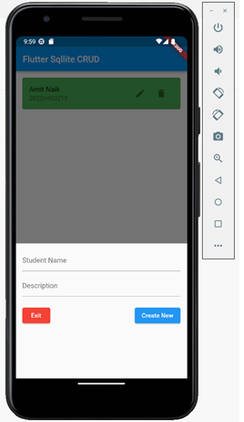

# flutter-sqlite-crud

## About
Flutter is a mobile app development framework that enables developers to build native mobile apps for Android, iOS, and other platforms using a single codebase. One of the popular ways to store and manage data in Flutter apps is by using SQLite, a lightweight, serverless, and open-source database engine that is well-suited for mobile app development.

Flutter provides an easy-to-use SQLite plugin that allows developers to perform various database operations such as creating tables, inserting data, querying data, and updating data. The plugin also supports asynchronous operations, which helps in building responsive and performant apps.

With Flutter and SQLite, developers can build powerful mobile apps that can store and manage data locally on the device. This is particularly useful for apps that need to work offline, or for apps that need to store user-specific data such as preferences or settings.

In addition to the core SQLite functionality, the Flutter SQLite plugin also provides features such as support for multiple databases, migrations, transactions, and more. These features make it easier for developers to manage and evolve their database schema over time, without having to worry about data loss or corruption.

## Output



## Plugin Required

```
sqflite: ^2.1.0
```

## Steps 

### Step 1: pubspec.yaml

Will configure in *pubspec.yaml* file sqflite.

```yaml
dependencies:
  flutter:
    sdk: flutter
  cupertino_icons: ^1.0.2
  sqflite: ^2.1.0
```

### Step 2: homepage.dart

Now, we will implement a modal for student data structure. For that we create homepage.dart file with student name and description properties and provide mapping for sqlite database. Following is the programming implementation of that

```dart
import 'package:flutter/material.dart';
import 'package:sqlite_crud/database_helper.dart';

class HomePage extends StatefulWidget {
  const HomePage({Key? key}) : super(key: key);

  @override
  _HomePageState createState() => _HomePageState();
}

class _HomePageState extends State<HomePage> {
  // All data
  List<Map<String, dynamic>> myData = [];
  final formKey = GlobalKey<FormState>();

  bool _isLoading = true;
  // This function is used to fetch all data from the database
  void _refreshData() async {
    final data = await DatabaseHelper.getItems();
    setState(() {
      myData = data;
      _isLoading = false;
    });
  }

  @override
  void initState() {
    super.initState();
    _refreshData(); // Loading the data when the app starts
  }

  final TextEditingController _titleController = TextEditingController();
  final TextEditingController _descriptionController = TextEditingController();

  // This function will be triggered when the floating button is pressed
  // It will also be triggered when you want to update an item
  void showMyForm(int? id) async {
    // id == null -> create new item
      // id != null -> update an existing item
    if (id != null) {      
      final existingData = myData.firstWhere((element) => element['id'] == id);
      _titleController.text = existingData['title'];
      _descriptionController.text = existingData['description'];
    } else {
      _titleController.text = "";
      _descriptionController.text = "";
    }

    showModalBottomSheet(
        context: context,
        elevation: 5,
        isDismissible: false,
        isScrollControlled: true,
        builder: (_) => Container(
            padding: EdgeInsets.only(
              top: 15,
              left: 15,
              right: 15,
              // prevent the soft keyboard from covering the text fields
              bottom: MediaQuery.of(context).viewInsets.bottom + 120,
            ),
            child: Form(
              key: formKey,
              child: Column(
                mainAxisSize: MainAxisSize.min,
                crossAxisAlignment: CrossAxisAlignment.end,
                children: [
                  TextFormField(
                    controller: _titleController,
                    validator: formValidator,
                    decoration: const InputDecoration(hintText: 'Student Name'),
                  ),
                  const SizedBox(
                    height: 10,
                  ),
                  TextFormField(
                    validator: formValidator,
                    controller: _descriptionController,
                    decoration: const InputDecoration(hintText: 'Description'),
                  ),
                  const SizedBox(
                    height: 20,
                  ),
                  Row(
                    mainAxisAlignment: MainAxisAlignment.spaceBetween,
                    children: [
                      ElevatedButton(
                          style: ElevatedButton.styleFrom(
                            backgroundColor: Colors.red,
                            foregroundColor: Colors.white,
                          ),
                          onPressed: () {
                            Navigator.pop(context);
                          },
                          child: const Text("Exit")),
                      ElevatedButton(
                        onPressed: () async {
                          if (formKey.currentState!.validate()) {
                            if (id == null) {
                              await addItem();
                            }

                            if (id != null) {
                              await updateItem(id);
                            }

                            // Clear the text fields
                            setState(() {
                              _titleController.text = '';
                              _descriptionController.text = '';
                            });

                            // Close the bottom sheet
                            Navigator.pop(context);
                          }
                          // Save new data
                        },
                        child: Text(id == null ? 'Create New' : 'Update'),
                      ),
                    ],
                  )
                ],
              ),
            )));
  }

  String? formValidator(String? value) {
    if (value!.isEmpty) return 'Field is Required';
    return null;
  }

// Insert a new data to the database
  Future<void> addItem() async {
    await DatabaseHelper.createItem(
        _titleController.text, _descriptionController.text);
    _refreshData();
  }

  // Update an existing data
  Future<void> updateItem(int id) async {
    await DatabaseHelper.updateItem(
        id, _titleController.text, _descriptionController.text);
    _refreshData();
  }

  // Delete an item
  void deleteItem(int id) async {
    await DatabaseHelper.deleteItem(id);
    ScaffoldMessenger.of(context).showSnackBar(const SnackBar(
        content: Text('Successfully deleted!'), backgroundColor: Colors.green));
    _refreshData();
  }

  @override
  Widget build(BuildContext context) {
    return Scaffold(
      appBar: AppBar(
        title: const Text('Flutter Sqllite CRUD'),
      ),
      body: _isLoading
          ? const Center(
              child: CircularProgressIndicator(),
            )
          : myData.isEmpty
              ? const Center(child: Text("No Data Available!!!"))
              : ListView.builder(
                  itemCount: myData.length,
                  itemBuilder: (context, index) => Card(
                    color: index % 2 == 0 ? Colors.green : Colors.green[200],
                    margin: const EdgeInsets.all(15),
                    child: ListTile(
                        title: Text(myData[index]['title']),
                        subtitle: Text(myData[index]['description']),
                        trailing: SizedBox(
                          width: 100,
                          child: Row(
                            children: [
                              IconButton(
                                icon: const Icon(Icons.edit),
                                onPressed: () =>
                                    showMyForm(myData[index]['id']),
                              ),
                              IconButton(
                                icon: const Icon(Icons.delete),
                                onPressed: () =>
                                    deleteItem(myData[index]['id']),
                              ),
                            ],
                          ),
                        )),
                  ),
                ),
      floatingActionButton: FloatingActionButton(
        child: const Icon(Icons.add),
        onPressed: () => showMyForm(null),
      ),
    );
  }
}

```

### Step 3: database_helper.dart

Will create database for crud operation file as *database_helper.dart* 

```dart
import 'package:flutter/foundation.dart';
import 'package:sqflite/sqflite.dart' as sql;

class DatabaseHelper {
 

  static Future<sql.Database> db() async {
    return sql.openDatabase(
      'flutterjunction.db',
      version: 1,
      onCreate: (sql.Database database, int version) async {
        await createTables(database);
      },
    );
  }

static Future<void> createTables(sql.Database database) async {
    await database.execute("""CREATE TABLE items(
        id INTEGER PRIMARY KEY AUTOINCREMENT NOT NULL,
        title TEXT,
        description TEXT,
        createdAt TIMESTAMP NOT NULL DEFAULT CURRENT_TIMESTAMP
      )
      """);
  }
// id: the id of a item
// title, description: name and description of  activity
// created_at: the time that the item was created. It will be automatically handled by SQLite
  // Create new item
  static Future<int> createItem(String? title, String? descrption) async {
    final db = await DatabaseHelper.db();

    final data = {'title': title, 'description': descrption};
    final id = await db.insert('items', data,
        conflictAlgorithm: sql.ConflictAlgorithm.replace);
    return id;

    // When a UNIQUE constraint violation occurs,
    // the pre-existing rows that are causing the constraint violation
    // are removed prior to inserting or updating the current row.
    // Thus the insert or update always occurs.
  }

  // Read all items
  static Future<List<Map<String, dynamic>>> getItems() async {
    final db = await DatabaseHelper.db();
    return db.query('items', orderBy: "id");
  }

  // Get a single item by id
  //We dont use this method, it is for you if you want it.
    static Future<List<Map<String, dynamic>>> getItem(int id) async {
    final db = await DatabaseHelper.db();
    return db.query('items', where: "id = ?", whereArgs: [id], limit: 1);
  }

  // Update an item by id
  static Future<int> updateItem(
      int id, String title, String? descrption) async {
    final db = await DatabaseHelper.db();

    final data = {
      'title': title,
      'description': descrption,
      'createdAt': DateTime.now().toString()
    };

    final result =
        await db.update('items', data, where: "id = ?", whereArgs: [id]);
    return result;
  }

  // Delete
  static Future<void> deleteItem(int id) async {
    final db = await DatabaseHelper.db();
    try {
      await db.delete("items", where: "id = ?", whereArgs: [id]);
    } catch (err) {
      debugPrint("Something went wrong when deleting an item: $err");
    }
  }
}

```

### Step 4: main.dart

Main page for inititate/start page

```dart
import 'package:flutter/material.dart';
import 'package:sqlite_crud/homepage.dart';

void main() {
  runApp(const MyApp());
}

class MyApp extends StatelessWidget {
  const MyApp({Key? key}) : super(key: key);

  // This widget is the root of your application.
  @override
  Widget build(BuildContext context) {
    return MaterialApp(
      title: 'Flutter Demo',
      theme: ThemeData(
        primarySwatch: Colors.blue,
      ),
      home: const HomePage(),
    );
  }
}

```